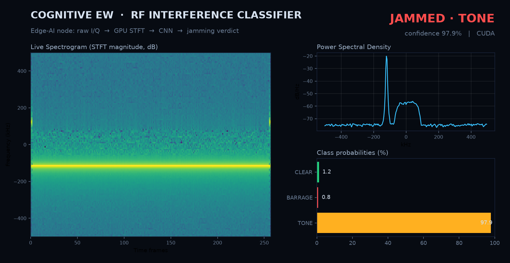
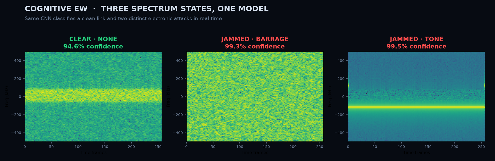

# GNSS Interference Detector

Detect and classify GPS jamming and spoofing over a region, using only free,
public aircraft data — no special hardware.



> **Two complementary layers.** A **GNSS jamming/spoofing detector** built from
> public aircraft data (this page), and a companion **cognitive-EW RF classifier**
> that identifies jamming *type* straight from raw radio I/Q — pictured above and
> documented in [RF jamming classifier](#rf-jamming-classifier-cognitive-ew) below.

Modern aircraft broadcast how confident they are in their own GPS position. When
many aircraft over the same area report degraded position quality, something on
the ground is interfering with GNSS. This project turns that crowd of aircraft
into a distributed interference sensor, then works out **whether the interference
is jamming or spoofing** from how the aircraft are actually moving.

This is a live, escalating real-world problem: reported GPS jamming rose sharply
across 2024–2026 in the Baltic, the eastern Mediterranean, the Black Sea and the
Persian Gulf, affecting both civil aviation and shipping.

---

## What it does

**Layer 1 — detection (`detect.py`).** Pulls one day of real interference data
from [GPSJam](https://gpsjam.org) and scores every map cell for the fraction of
aircraft reporting degraded GPS. Output: a map of *where* GPS is being attacked.

**Layer 2 — classification (`classify.py`).** For each hot cell, pulls aircraft
position tracks from [OpenSky](https://opensky-network.org) and decides *which
kind* of attack it is, from two opposite signatures:

| Signature | Jamming | Spoofing |
|---|---|---|
| The receiver is… | denied a fix | fed a false fix |
| Position updates | go **stale** / stop | keep coming (but are wrong) |
| Track shape | normal where present | **teleports**, or many aircraft on one fake point |
| Aircraft still in contact? | yes (Mode-S continues) | yes |

So: **high interference + stale positions → JAMMING**;
**high interference + teleports / fake cluster → SPOOFING**; both → MIXED.

**The map (`gnss-real-data-map.html`).** An interactive console showing Layer 1
on a real day (2023-10-10 is bundled), with a per-cell inspector.

---

## Why this design is honest about its limits

Good defensive tooling is explicit about where its signal runs out. This project
is built around three real constraints, not in spite of them:

1. **Daily, not real-time.** GPSJam aggregates 24 h of aircraft reports into one
   snapshot per day. That's the ceiling for this free source. True second-by-second
   detection needs a direct ADS-B feed (paid API or your own receiver) — see Roadmap.
2. **Fetching is server-side, by necessity.** A browser can't pull GPSJam or
   OpenSky directly (no CORS + sandboxing). The scripts fetch; the page reads the
   result. That separation is the correct architecture for this kind of tool.
3. **Classification needs enough aircraft.** Over closed or empty airspace there
   are few reports, so confidence drops — and the worst-jammed airspace is often
   the emptiest. The code reports low confidence rather than guessing, and treats
   the *absence* of data over a known hotspot as a signal in itself.

---

## Quickstart

```bash
pip install requests h3

# Layer 1 — most recent available day, automatically
python detect.py
#   → prints the exact date it fetched (and flags incomplete days)
#   → writes theater.geojson, then open gnss-real-data-map.html

python detect.py 2023-10-10        # or any specific date back to 2022-02-14

# Layer 2 — classify the hot cells as jamming vs spoofing
export OPENSKY_CLIENT_ID=...       # from opensky-network.org → Account → API client
export OPENSKY_CLIENT_SECRET=...
python classify.py

# Prove the classifier logic on known fixtures (no network needed)
python classify.py --selftest
```

`--selftest` builds three synthetic cells (clean / jamming / spoofing) with the
defining behavior of each and asserts the classifier labels them correctly. It's
how the detection logic is verified independently of live data.

---

## Method detail

**Interference score (Layer 1)** uses GPSJam's own metric per cell:
`score = max(0, bad − 1) / (good + bad)`. The `− 1` suppresses false alarms in
cells with very few aircraft. Cells: H3 hexagons at resolution 4.

**Movement features (Layer 2)**, per aircraft, from stitched OpenSky snapshots:
- *teleport* — an implied speed > 500 m/s (~1800 km/h) or a single step > 150 km.
- *stale position* — `last_contact − time_position > 30 s` (still talking, but GPS frozen).
- *spoof cluster* — ≥ 5 distinct airborne aircraft within 3 km of one point.

Thresholds live at the top of `classify.py` and are documented inline so a
reviewer can see (and challenge) the reasoning.

---

## Data sources & attribution

- **GPSJam** — daily GPS interference, CC-BY, by John Wiseman, derived from
  ADS-B Exchange aircraft navigation-integrity reports.
- **OpenSky Network** — live aircraft state vectors, free for non-commercial /
  research use (OAuth2 client-credentials).

Credit both if you publish anything built on this.

---

## Roadmap

- **Layer 3 — decode integrity yourself.** Drop below aggregated feeds and pull
  NIC / NACp out of raw ADS-B messages with `pyModeS`. Proves understanding of
  the protocol at the bit level rather than just the API.
- **Toward real-time.** Replace the daily GPSJam layer with a live ADS-B feed
  (a ~$30 RTL-SDR + `readsb`, or a paid ADS-B Exchange tier) for minute-scale
  detection.
- **Validation against ground truth.** Cross-check detected events against
  published NOTAMs and reporting for known jamming/spoofing incidents.

---

## RF jamming classifier (`cognitive-ew/`)

A companion, GPU-accelerated edge-AI node that works one layer lower — on raw
radio I/Q rather than aircraft reports — and classifies the RF spectrum in real
time as **clear**, **barrage-jammed**, or **tone-jammed**.



**Pipeline:** raw I/Q → GPU STFT → CNN (`CognitiveEWNet`) → jamming verdict.

| Class | Meaning |
|---|---|
| `CLEAR / NONE` | Nominal link (Doppler, multipath fading, thermal noise) |
| `JAMMED / BARRAGE` | Wideband noise — raises the whole noise floor |
| `JAMMED / TONE` | Narrowband continuous-wave — a sharp spectral spike |

**Components** (all in [`cognitive-ew/`](cognitive-ew/)):
- `realistic_rf_env.py` — synthesizes QPSK I/Q with channel impairments + jamming profiles.
- `train_pipeline.py` / `train_and_save.py` — define and train `CognitiveEWNet`; write `cognitive_ew_model.pth`.
- `inference_node.py` — FastAPI service (`POST /predict`), STFT + inference on the GPU.
- `live_server.py` — live browser dashboard (spectrogram, PSD, rolling accuracy).
- `make_hero.py` / `make_montage.py` — regenerate the two images above.

**Run it:**

```powershell
cd cognitive-ew
python -m venv .venv; .venv\Scripts\activate
pip install torch fastapi uvicorn numpy scipy matplotlib requests
python inference_node.py     # REST API      -> http://127.0.0.1:8000/docs
python test_client.py        # streams a jammed signal, prints the verdict
python live_server.py        # live dashboard -> http://127.0.0.1:8010/
```

Example `POST /predict` response:

```json
{ "status": "JAMMED", "type": "TONE", "confidence": 0.9801, "hardware_accelerated": true }
```

An NVIDIA GPU is used automatically when available; otherwise it falls back to CPU.

---

## Project notes for review

What this is meant to demonstrate: taking a vague but real mission ("tell me where
GPS is being attacked, and how") and building the whole pipeline — data ingest,
scoring, a movement-based classifier, a map — while being precise about what the
data can and cannot support. The jamming-vs-spoofing distinction, the daily-vs-
real-time ceiling, and the low-confidence handling over empty airspace are the
parts worth talking through.
